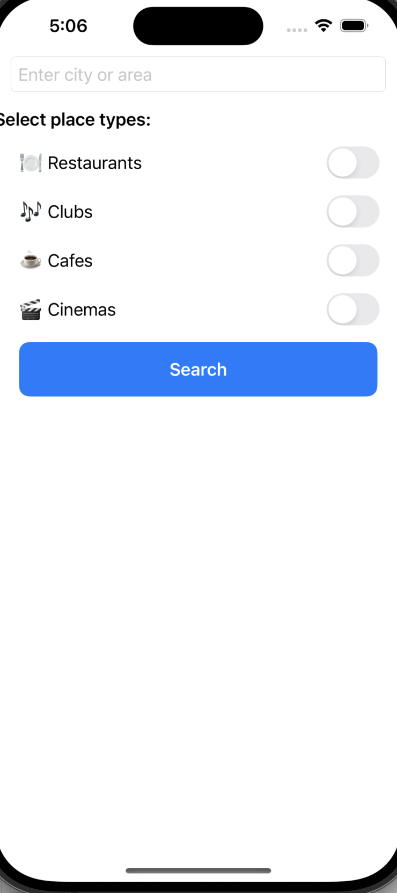
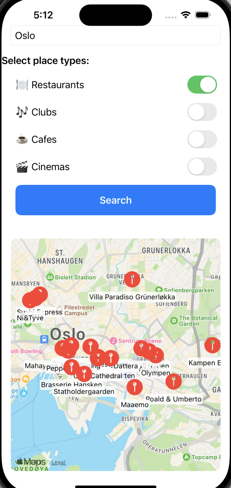

# 📍 Nearby Places App – SwiftUI + Geoapify

A modern iOS app that allows users to search for nearby restaurants, cafés, cinemas, and clubs in any city. Built with SwiftUI and MapKit, it features dynamic category filtering, real-time map pins, and full gesture interaction support like zooming and panning.

---

## 🔄 Project Evolution

### ✨ Old Version
- Only used current location (no manual input)
- No filtering or category selection
- No zoom/pan gestures
- Flat UI and limited logic separation

### 🌟 New Version
- ✅ User can **enter any city or area** manually
- ✅ **Dynamic category filters** via checkboxes (Restaurants, Cafes, Clubs, Cinemas)
- ✅ **Zoomable and pannable map** using `Map` + gesture support
- ✅ Pins show **place names** on the map
- ✅ Clean separation of logic via `GeocoderManager` and `PlaceManager`

---

## 🧠 Technologies Used

- SwiftUI
- MapKit
- Geoapify Places API
- CoreLocation
- MV-like structure (logic extracted to separate files)

---

## 📸 Screenshots

| City Search & Filters | Map View with Zoom |
|------------------------|--------------------|
|  |  |

> Make sure to add your actual screenshots to a `screenshots/` folder in the repo.

---

## 🚀 Features

- 🌍 Manual location search (by city name)
- ✅ Checkbox filters for types of places
- 🗺️ Interactive Map:
  - Zoom in/out with pinch gesture
  - Pan with swipe
  - Custom pins with place labels
- 🧭 Automatic map centering on result city
- 🛠️ Simple code structure, great for showcasing SwiftUI + MapKit integration

---

## 💡 Future Improvements

- Show alert if city is invalid or no places found
- Display loading spinner while fetching
- Allow user to tap pin and get more info
- Optional theme switch (Light/Dark)
- Add bottom sheet for place previews

---

## 📬 Feedback

Pull requests, bug reports, or feedback are always welcome!

---

## 📄 License

This project is built for educational and portfolio purposes.  
Please respect [Geoapify’s Terms of Use](https://www.geoapify.com/terms-of-use/) for API access.

